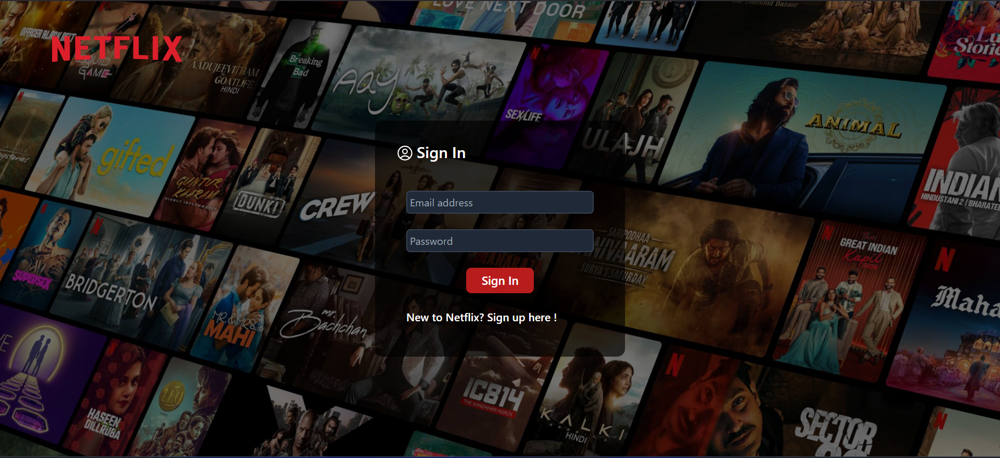
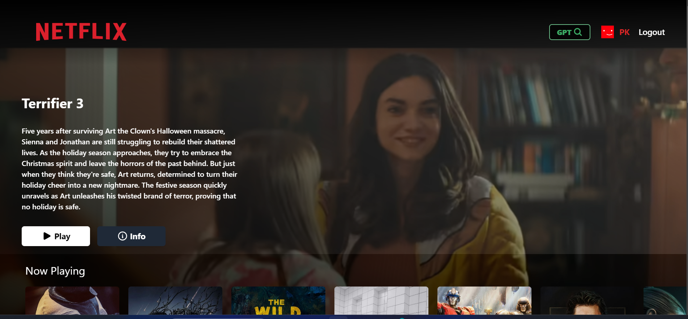
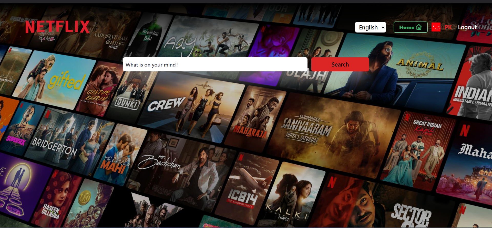

# Netflix Clone with chatGPT

A fully functional Netflix clone built with **React**, **Redux**, and **Firebase**, featuring **TMDB API** for movie data and **OpenAI API** for movie recommendations.

🌐 **Live Demo:** [Netflix Clone](https://netflix-gpt-420.firebaseapp.com/)

> **Note:** TMDB API may not work in some regions, such as India. Please use a VPN to access the full functionality.


## 🚀 Features

- **User Authentication:** Secure user authentication using Firebase.
- **Movie Database:** Display trending movies by categories via TMDB API.
- **Movie Suggestions:** Search for movie suggestions using the OpenAI API.
- **Responsive Design:** Optimized for desktop and mobile.
- **Redux Store:** Centralized state management for efficient data handling.

## 🛠️ Technologies Used

- **React:** Frontend library for building user interfaces.
- **Redux:** State management for scalable applications.
- **Firebase:** User authentication and database.
- **TMDB API:** Fetches movie details.
- **OpenAI API:** Provides AI-powered movie recommendations.
- **Tailwind CSS:** Styling and layout.

## 📸 Screenshots





## 🧰 Installation & Setup

To get started, follow these steps:

1. **Clone the repository:**
   ```bash
   git clone https://github.com/Pushparaj96/netflix-clone.git

